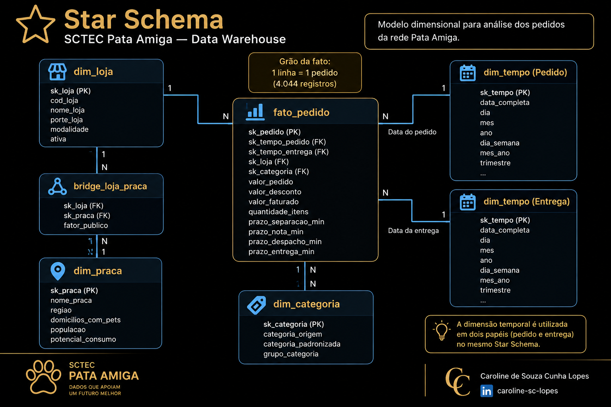

# Pata Amiga — Data Warehouse

## Sobre o projeto

A Pata Amiga é uma rede catarinense de pet shops. Começou com uma loja em Blumenau, em 2009, e atualmente possui 32 lojas espalhadas pelo estado, de Itapoá a São Miguel do Oeste.

Este projeto apresenta a construção de um Data Warehouse para análise dos dados de pedidos da rede Pata Amiga, utilizando modelagem dimensional, processos de tratamento e padronização dos dados e consultas SQL orientadas às cinco perguntas de negócio propostas.

## Objetivo

Construir uma base analítica capaz de transformar os dados operacionais de pedidos em informações para apoiar decisões sobre logística, vendas, canais, distribuição regional e expansão da rede.

## Perguntas de negócio

### P1 — Onde está o gargalo da entrega?

A análise considerou os quatro intervalos do processo logístico: Integração → Separação, Separação → Nota, Nota → Despacho e Despacho → Entrega, além do tempo total entre a entrada do pedido no ERP e a entrega ao cliente.

Nas lojas Grandes, o tempo médio total até a entrega foi de 7,93 dias. Nas lojas Médias, foi de 7,95 dias, enquanto nas lojas Pequenas chegou a 15,16 dias.

Entre os quatro intervalos analisados, o maior tempo médio ocorreu entre a emissão da nota fiscal e o despacho. Nas lojas Grandes, esse intervalo apresentou média de 3,32 dias; nas lojas Médias, 3,33 dias; e nas lojas Pequenas, 8,52 dias.

**O gargalo não está na entrega, e sim entre a nota fiscal e o despacho.** Esse comportamento aparece nos três portes analisados, mas é significativamente mais crítico nas lojas Pequenas, que também apresentam o maior tempo total médio até a entrega.

Portanto, a etapa Nota → Despacho deve ser priorizada na investigação e na melhoria do processo logístico, especialmente nas lojas Pequenas.

Como leitura crítica, os dados permitem identificar onde ocorre o maior tempo médio do processo, mas não permitem afirmar, isoladamente, qual é a causa operacional específica dos atrasos. Para identificar essa causa, seriam necessários dados adicionais sobre capacidade operacional, equipe, volume processado e motivos de retenção dos pedidos.

[📊 Ver gráfico P1 — Tempo médio por porte](graficos/P1_tempo_medio_por_porte.png)

### P2 — Qual categoria concentra o faturamento?

A análise do faturamento por categoria mostra uma forte concentração em Ração. Do faturamento total analisado, a categoria Ração representa R$ 1.076.202,55, correspondendo a 60,01% do faturamento da rede.

As demais categorias apresentam participações significativamente menores: Medicamento representa 17,06%, Petisco 7,17%, Serviço 5,24%, Higiene 5,15%, Acessório 3,61% e Brinquedo 1,76%.

A categoria Ração também foi a líder de faturamento nos três portes de loja analisados. Nas lojas Grandes, foram registrados R$ 468.186,60; nas lojas Médias, R$ 443.131,62; e nas lojas Pequenas, R$ 164.197,55.

Os resultados mostram que a Ração é a principal categoria de faturamento da rede, independentemente do porte da loja. Com 60,01% do faturamento, existe uma concentração relevante nessa categoria, o que evidencia sua importância para o desempenho comercial da Pata Amiga.

Como leitura crítica, a análise permite identificar a concentração do faturamento e a categoria líder, mas não permite afirmar que a Ração seja responsável pela maior margem ou lucratividade da rede, pois os dados analisados representam faturamento e não contemplam informações suficientes sobre custos, margens ou rentabilidade por categoria.

[📊 Ver gráfico P2 — Faturamento por categoria](graficos/P2_faturamento_por_categoria.png)

### P3 — Como se comportam os canais de venda?

A análise comparou o ticket médio dos pedidos com e sem desconto nos cinco canais de venda: App, Site, Loja Física, Telefone e WhatsApp. Os pedidos com `HouveDesconto = Nao Informado` foram mantidos na consulta, mas não foram considerados na comparação entre pedidos com e sem desconto.

Nos cinco canais analisados, o ticket médio dos pedidos com desconto foi superior ao dos pedidos sem desconto. No App, o ticket médio foi de R$ 488,04 com desconto e R$ 170,48 sem desconto. No Site, foi de R$ 501,92 com desconto e R$ 189,48 sem desconto. Na Loja Física, R$ 494,04 com desconto e R$ 196,78 sem desconto. No Telefone, R$ 514,02 com desconto e R$ 195,46 sem desconto. No WhatsApp, R$ 514,33 com desconto e R$ 173,88 sem desconto.

Em relação à participação no faturamento, o App foi o principal canal, com R$ 552.134,43, correspondendo a 32,95% do faturamento. Em seguida aparecem o Site, com R$ 450.569,37 (26,89%), a Loja Física, com R$ 360.677,22 (21,53%), o WhatsApp, com R$ 188.678,63 (11,26%), e o Telefone, com R$ 123.419,29 (7,37%).

Os resultados mostram que o App concentra a maior parcela do faturamento entre os canais analisados. Também foi observado um ticket médio maior nos pedidos com desconto em todos os cinco canais.

Como leitura crítica, essa comparação mostra uma associação entre desconto e ticket médio mais elevado, mas não permite afirmar que o desconto tenha causado o aumento do valor dos pedidos. Outros fatores, como perfil do cliente, produtos adquiridos e valor original da compra, podem influenciar o resultado.

[📊 Ver gráfico P3 — Faturamento por canal](graficos/P3_faturamento_por_canal.png)

### P4 — Como o faturamento se distribui pelas praças?

O faturamento das lojas foi rateado entre as praças de atendimento utilizando o `fator_publico` definido na tabela `bridge_loja_praca`. Essa abordagem permite representar corretamente o relacionamento em que uma loja pode atender mais de uma praça.

A maior parcela do faturamento rateado está concentrada na praça **Vale do Itajaí**, com **R$ 633.746,09**. Em seguida aparecem Grande Florianópolis, com R$ 283.546,75; Norte Industrial, com R$ 175.431,90; Litoral Sul, com R$ 137.051,20; Litoral Norte, com R$ 128.872,75; Extremo Oeste, com R$ 98.359,18; Carbonífera, com R$ 88.707,42; Serra Catarinense, com R$ 80.477,64; Meio-Oeste, com R$ 58.955,63; Foz do Itajaí, com R$ 46.749,72; Planalto Norte, com R$ 31.100,84; e Planalto Serrano, com R$ 29.323,10.

O rateio permite relacionar o faturamento das praças com a quantidade de domicílios com pets. No Vale do Itajaí, por exemplo, foram considerados **148 domicílios com pets**. Essa comparação ajuda a avaliar a concentração do faturamento em relação ao público potencial de cada praça.

Na reconciliação, o faturamento total dos pedidos com loja identificada foi de **R$ 1.793.308,51**, enquanto o faturamento efetivamente alocado às praças foi de **R$ 1.792.322,21**. A diferença de **R$ 986,30** corresponde aos três pedidos sem loja identificada, que não puderam ser associados a uma praça.

Como leitura crítica, o rateio representa uma distribuição estimada do faturamento entre as praças com base no `fator_publico`. Portanto, o valor atribuído a cada praça não representa necessariamente o faturamento diretamente observado naquela região. Além disso, os pedidos sem loja identificada não podem ser distribuídos pelas praças com os dados disponíveis.

[📊 Ver gráfico P4 — Faturamento por praça](graficos/P4_faturamento_por_praca.png)

### P5 — Onde existe oportunidade para uma nova loja?

A análise buscou identificar cidades com maior intensidade de itens vendidos por mil habitantes e relacionar esse indicador ao tempo médio de entrega. Essa combinação permite observar, ao mesmo tempo, o potencial de demanda e o desempenho logístico das cidades analisadas.

Entre os resultados obtidos, **Rio dos Cedros** apresentou a maior intensidade observada, com **23,58 itens vendidos por mil habitantes** e tempo médio de entrega de **14,24 dias**. Esse resultado coloca o município como um candidato para investigação de uma possível expansão da rede.

A análise também mostrou o faturamento por **faixa de franquia atual**: Ouro, R$ 1.011.264,38; Diamante, R$ 382.209,74; Prata, R$ 314.812,03; Bronze, R$ 84.036,06; e Não Informado, R$ 986,30.

Entretanto, essa informação representa apenas a **fotografia atual do cadastro**. A faixa de franquia disponível hoje não permite reconstruir qual era a faixa de cada loja na data de cada pedido. Portanto, os dados não permitem afirmar quanto do faturamento veio de lojas que **já eram Ouro no momento do pedido**.

A análise dos registros que ficaram de fora também identificou **3 pedidos sem loja identificada**, **1.953 entregas ainda não concluídas**, **257 registros com itens em branco** e **121 registros com valores em branco**. Essas ocorrências devem ser consideradas na interpretação dos resultados e nas decisões baseadas nos indicadores.

A recomendação, portanto, é considerar **Rio dos Cedros como candidato para uma nova loja**, combinando a elevada intensidade de itens por mil habitantes com a análise do tempo médio de entrega. A decisão definitiva de expansão, porém, deve ser complementada por informações que não estão disponíveis no conjunto analisado, como histórico da faixa de franquia, custos de instalação, concorrência local e potencial de mercado.

Como leitura crítica, o indicador de itens por mil habitantes é uma medida de intensidade da demanda observada, mas não representa sozinho a viabilidade econômica de uma nova unidade. Além disso, os dados disponíveis não permitem reconstruir historicamente a faixa de franquia das lojas nem determinar, isoladamente, a causa operacional dos atrasos logísticos.

[📊 Ver gráfico P5 — Itens por mil habitantes](graficos/P5_itens_por_mil_habitantes.png)

## Diagnóstico dos dados de origem

Antes da construção das dimensões e da tabela fato, os dados de origem
foram analisados para identificar variações de grafia, ausência de
informações e inconsistências que poderiam impactar o modelo analítico.

### Principais diagnósticos

| Verificação | Resultado |
|---|---:|
| Pedidos analisados | 4.044 |
| Grafias distintas de loja | 128 |
| Grafias distintas de categoria | 37 |
| Grafias de `HouveDesconto` | 17 |
| Grafias de `CanalPedido` | 20 |
| Pedidos sem código da loja | 1.575 |
| Pedidos sem nome da loja | 3 |
| Separação sem preenchimento | 1.077 |
| Nota sem preenchimento | 1.338 |
| Despacho sem preenchimento | 1.665 |
| Entrega sem preenchimento | 1.953 |

Esses diagnósticos orientaram as etapas de padronização, tratamento dos
dados e definição das regras utilizadas na construção do Data Warehouse.

## Tratamento e padronização dos dados

Os dados brutos foram mantidos na camada de staging e utilizados como
fonte para as transformações necessárias à construção do Data Warehouse.

### Padronização de lojas

Os nomes das lojas foram tratados com remoção de variações de grafia,
padronização para maiúsculas e normalização de caracteres.

A padronização foi realizada antes do lookup na dimensão de lojas, garantindo que as diferentes grafias da origem fossem comparadas com o nome padronizado.

Também foram realizadas correções manuais identificadas durante a
análise dos dados de origem:

- `PATA AMIGA BLUMENAL CENTRO` → `PATA AMIGA BLUMENAU CENTRO`
- `PATA AMIGA FLORIPA NORTE` → `PATA AMIGA FLORIANOPOLIS NORTE`
- `PATA AMIGA JGUA DO SUL` → `PATA AMIGA JARAGUA DO SUL`

### Padronização de categorias

As 37 grafias distintas identificadas na origem foram padronizadas e
classificadas nas 7 categorias utilizadas no modelo analítico.

Além da categoria padronizada, foi criado o agrupamento das categorias
em grupos de negócio:

| Categoria | Grupo |
|---|---|
| Racao | Alimentacao |
| Petisco | Alimentacao |
| Medicamento | Saude e Higiene |
| Higiene | Saude e Higiene |
| Brinquedo | Bem-estar |
| Acessorio | Bem-estar |
| Servico | Bem-estar |

Valores que não puderam ser classificados foram direcionados para
`Nao Informado`.

### Padronização de desconto

As diferentes representações do campo `HouveDesconto` foram
convertidas para três estados:

- `Sim`
- `Nao`
- `Nao Informado`

### Padronização do canal de pedido

Os valores de `CanalPedido` foram classificados nas categorias:

- `WhatsApp`
- `App`
- `Site`
- `Loja Fisica`
- `Telefone`
- `Nao Informado`

A ordem das regras foi definida para evitar classificações incorretas
quando uma descrição contém mais de um termo identificador.

### Tratamento de datas e valores numéricos

As datas de pedido foram convertidas a partir do formato americano
`MM/DD/YYYY HH12:MI AM`, enquanto os quatro marcos do processo de entrega
foram tratados a partir do formato `YYYY-MM-DD`.

Os valores numéricos e monetários foram padronizados durante a carga,
considerando as diferentes representações presentes na origem. Valores
vazios ou iguais a `-` foram gravados como `NULL`, nunca como zero.

### Tratamento de informações ausentes

Informações inexistentes ou não identificadas foram tratadas conforme
a natureza do dado. Na tabela fato, a ausência de uma dimensão de loja
é representada pelo registro padrão de chave substituta `-1`.

Nos marcos de processo logístico, quando não existe a data/hora final
necessária para calcular um intervalo, o resultado permanece como
`NULL`, evitando interpretar uma informação ausente como duração zero.

## Modelo dimensional — Star Schema

O Data Warehouse foi estruturado utilizando o modelo dimensional
Star Schema, com a tabela fato no centro e as dimensões relacionadas
por chaves substitutas.

### Tabela fato

**`fato_pedido`**

Centraliza os pedidos e as principais métricas utilizadas nas análises,
incluindo valores financeiros e intervalos de tempo do processo logístico.

### Dimensões

- **`dim_tempo`** — dimensão de tempo utilizada em dois papéis:
  data do pedido e data da entrega.
- **`dim_loja`** — informações das lojas, incluindo cidade, porte e
  população da cidade.
- **`dim_categoria`** — categorias padronizadas dos produtos/serviços.
- **`dim_praca`** — praças de atendimento e informações utilizadas
  nas análises regionais.

### Tabela ponte

**`bridge_loja_praca`**

Representa o relacionamento entre lojas e praças, permitindo que uma
loja esteja associada a mais de uma praça.

O campo `fator_publico` representa a participação da loja na praça.
Os fatores de cada loja totalizam 1,00 e são utilizados para ratear o
faturamento na análise da P4.

### Esquema

## Estrutura do banco e reprodução

O projeto utiliza PostgreSQL e está organizado em camadas de staging,
dimensional e fato.

### Estrutura do modelo

- `stg_pedido` — dados de pedidos e marcos do processo de entrega.
- `stg_loja` — cadastro das lojas.
- `stg_loja_praca` — relacionamento entre lojas e praças.
- `dim_tempo` — dimensão de tempo.
- `dim_loja` — dimensão de lojas.
- `dim_categoria` — dimensão de categorias.
- `dim_praca` — dimensão de praças.
- `bridge_loja_praca` — tabela ponte entre lojas e praças.
- `fato_pedido` — tabela fato, com grão de 1 linha por pedido.

A tabela `fato_pedido` possui 4.044 linhas, mantendo o grão definido
no projeto: 1 linha = 1 pedido. 

### Ordem de execução

Para reproduzir o banco do zero, os scripts de construção devem ser
executados na seguinte ordem:

1. `sql/01-carga-staging.sql`
2. `sql/02-dimensoes-prontas.sql`
3. `sql/03-dimensoes.sql`
4. `sql/04-fato.sql`
5. `sql/05-analises.sql`

O arquivo `sql/00-conferencia.sql` é utilizado para conferência dos
resultados após cada etapa e não faz parte da sequência de construção
do banco.

A área de staging representa os dados de origem e não deve ser alterada.
As transformações são realizadas durante a carga das dimensões e da
tabela fato. 

As dimensões `dim_tempo` e `dim_loja` são fornecidas prontas no projeto,
enquanto `dim_categoria`, `dim_praca` e `bridge_loja_praca` são
construídas durante o desenvolvimento. 

## Recomendação final e limitações

A análise dos dados indica que a principal oportunidade de melhoria está no processo logístico, especialmente no intervalo entre a emissão da nota fiscal e o despacho, que apresentou o maior tempo médio nos três portes de loja. O problema é mais acentuado nas lojas Pequenas.

No faturamento, a categoria Ração se destaca de forma consistente, representando 60,01% do faturamento analisado e liderando nos três portes de loja. Entre os canais, o App concentra a maior participação no faturamento, com 32,95%.

Na análise das praças, o Vale do Itajaí apresentou o maior faturamento rateado. O rateio também permitiu relacionar o faturamento às informações de domicílios com pets, respeitando o fator público definido para cada relacionamento entre loja e praça.

Para a expansão da rede, Rio dos Cedros se apresenta como um candidato a ser investigado, por apresentar a maior intensidade observada de itens vendidos por mil habitantes, combinada com a análise do tempo médio de entrega. Essa indicação deve ser tratada como uma oportunidade para investigação, e não como uma decisão definitiva de abertura de loja.

### Limitações dos dados

Os resultados devem ser interpretados considerando as limitações identificadas na origem dos dados. A faixa de franquia disponível representa o cadastro atual das lojas e não permite reconstruir historicamente a faixa vigente na data de cada pedido.

Além disso, existem pedidos sem código ou identificação de loja, entregas ainda não concluídas e campos de processo sem preenchimento. Essas situações exigem tratamento específico e podem limitar determinadas análises.

Os dados também não permitem afirmar causalidade entre desconto e aumento do ticket médio, nem determinar a causa operacional específica dos atrasos logísticos. Da mesma forma, o faturamento por categoria não representa margem ou lucratividade, pois não há dados suficientes de custos.

Assim, as recomendações apresentadas representam uma leitura analítica dos dados disponíveis e devem ser complementadas por informações operacionais, financeiras e de mercado antes de decisões definitivas.

---

**Caroline de Souza Cunha Lopes**
